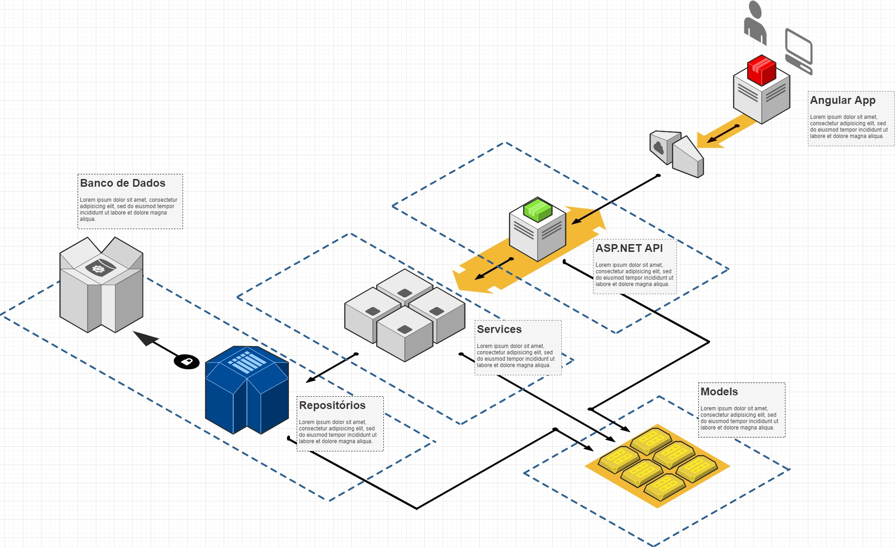

# 1. Explicação sobre a solução encontrada

### Server: 
Uma solução .NET Core com arquitetura separada em camadas servindo requisições REST como mostra o diagrama abaixo:

- API: Atual interface onde os cliente podem interagir com a aplicação através de requisições HTTP no padrão REST. A APi foi feita em ASP.NET Core. 
- Database (Banco de Dados) - Onde os dados são guardados, o Banco de dados.
- DAO (Respositorios): Onde as entidades de acesso aos dados ficam e, na implementação, usei o EntityFramework Core com o padrão Code First.
- Services: Onde as logicas de negócio são processadas e somente nela. 
- Models: Entidades compartilhadas para todas as camadas do projeto permitindo plena comunicação de dados entre as camadas.

A Aplicação usa Injeção de dependência para ter a menor a coplação possível resultando em uma melhor manutenção do código. Também evita que mais de entidade seja criada aumentando desnecessáriamente o consumo de memória.
O ciclo de vida das dependências, eu escolhi no modo escopo, que garante uma entidade por requisição evitando conflitos de abertura de conexão com o banco na mesma instância por multiplas threads visto que o EntityFramewok tem problemas com essa abordagem. 
Em ambiente de desenvolvimente é utilizado um banco em memória. Ao inicializar, são populados dados de sensores representando requisiçõe, equivalentes a 2 min (futuros).

### Cliente:
Uma aplicação web utilizando o framework Angular na versão 9. A aplicação é uma pagina única com 3 widgets para a visualização de dados conforme as necessidades dadas.

- Grafico: Foi implementado um grafico de linha que se atualiza buscando dados de 15 em 15segundos. Cada ponto representa a quantidade de requisições apenas com valor numérico. Utilizei a implementação em angular ng2-charts que tem a dependencia do pacote chart.js. Poderia ter usado outra porem essa é de simples implementação e muito personalizavel.

- Tabela de sensores: Uma tabela dinâmica, auto-atualizada periodicamente e busca dados de forma paginada para não buscar dados desnecessários. Há um filtro que interage com todos os campos, menos o de data, facilitando mais a vizualização de dados e também trabalha de forma paginada com o mesmo intúito. Nesse caso, utilizei a implementação em angular Angular Material que fornece tanto uma gama de componentes multi-uso como framework css baseado no Material Design. 

- Tabela de totais: Uma tabela ao lado direito da pagina, montada em tags html e diretivas condicionais e de repetição além de estilização manual e implementos da biblioteca css Bootstrap.

# 2. Tecnologias envolvidas 

* .NET Core v2.2 e v3.0
	* ASP.NET Core
	* EntityFrameworkCore 2.2.6
	* EntityFrameworkCore InMemory 2.2.6
	* EntityFrameworkCore SqlServer 2.2.6
	* ReflectionIT Mvc Paging v3.5
* Node v12.16
* Angular v9
	* Angular Material v9.2
	* Bootstrap v4.4
	* ng2-charts v2.3
	* chart.js v2.9.3

# 3. Instrução de uso da solução.

É necessário ter o SDK .NET Core 2.2 e 3.0 e o Node v12.16 instalado.

## 3.1 Execução API: 
Abra um terminar na pasta raiz da API ".../SENSORTRACKING.API" e execute o comando:
	`dotnet run`
A API inicializará no endereço "http://localhost:5002" como configurado. 

## 3.2 Execução da Aplicação Web: 
Abra um terminal na pasta raiz do projeto ".../sensortracking-web" e execute 2 comandos comando, nesta ordem:
`npm install` - baixa todos os pacotes npm que a aplicação depende.
`npm start` - inicializa a aplicação através de scripts internos utilizando o node server.js
